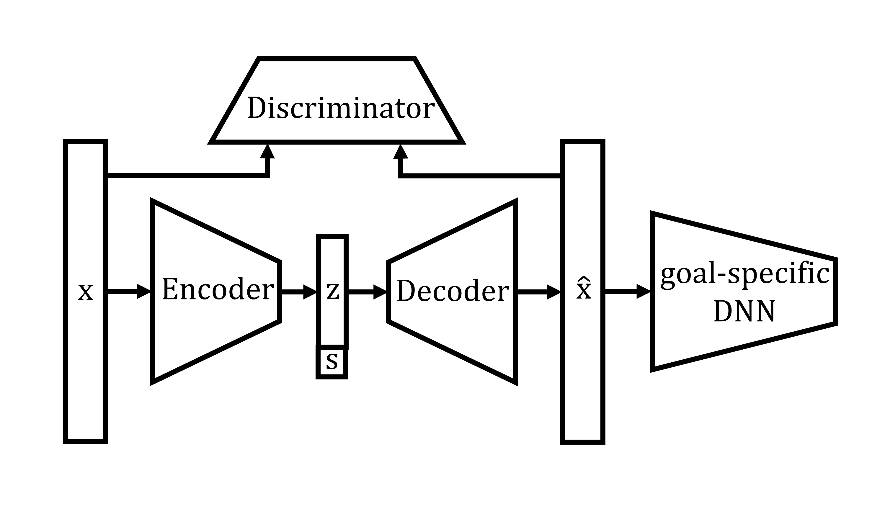

# Goal-specific brain MRI harmonization

## References

+ An, L., Chen, J., Chen, P., Zhang, C., He, T., Chen, C., Zhou, J., Yeo, B.T., 2022. [Goal-specific brain MRI harmonization](https://doi.org/10.1016/j.neuroimage.2022.119570), NeuroImage, 119570

----

## Background


There is significant interest in pooling magnetic resonance image (MRI) data from multiple datasets to enable mega-analysis. Harmonization is typically performed to reduce heterogeneity when pooling MRI data across datasets. Most MRI harmonization algorithms do not explicitly consider downstream application performance during harmonization. However, the choice of downstream application might influence what might be considered as study-specific confounds. Therefore, ignoring downstream applications during harmonization might potentially limit downstream performance. We propose a goal-specific harmonization framework that utilizes downstream application performance to regularize the harmonization procedure. Three datasets from three different continents with a total of 2787 participants and 10085 anatomical T1 scans were used for evaluation. Using three large-scale datasets, we demonstrated that our approach (gcVAE) compared favorably with existing approaches in terms of preserving relevant biological information, while removing site differences.



----

## Code Release

### Download stand-alone repository
Since the whole Github repository is too big, we provide a stand-alone version of only this project and its dependencies. To download this stand-alone repository, visit this link: [https://github.com/ThomasYeoLab/Standalone_An2022_gcVAE](https://github.com/ThomasYeoLab/Standalone_An2022_gcVAE)

### Download whole repository
If you want to use the code from our lab's other stable projects (other than An2022_gcVAE), you would need to download the whole CBIG repository.

- To download the version of the code that was last tested, you can either

    - visit this link:
    [https://github.com/ThomasYeoLab/CBIG/releases/tag/v0.23.0-An2022_gcVAE](https://github.com/ThomasYeoLab/CBIG/releases/tag/v0.23.0-An2022_gcVAE)

    or

    - run the following command, if you have Git installed
 
    ```
    git checkout -b An2022_gcVAE v0.23.0-An2022_gcVAE
    ```
----

## Usage

### Environment setup
- Our code uses Python and R, here is the setup:
    1. Install [Miniconda](https://docs.conda.io/en/latest/miniconda.html) or [Anaconda](https://www.anaconda.com/distribution/#download-section) with Python 3.x if you don't have conda
    2. Create conda environment from our `replication/config/CBIG_gcVAE_python_env.yml` file by `conda env create -f replication/config/CBIG_gcVAE_python_env.yml`

### Example
- The example of our code is detailed in `examples/README.md`

### Replication
- If you have access to ADNI, AIBL and MACC dataset, you can replicate our result using the instructions detailed in `replication/README.md`.


----

## Updates

- Release v0.23.0 (25/08/2022): Initial release of An2022_gcVAE project

----


## Bugs and Questions

Please contact Lijun An at anlijuncn@gmail.com and Thomas Yeo at yeoyeo02@gmail.com
